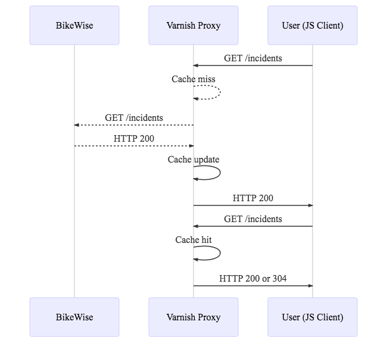
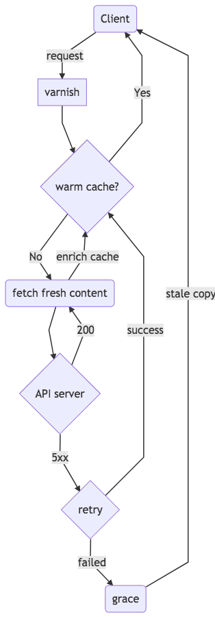

# HTTP Caching

An easy and effective way to cache HTTP response is to use a reverse proxy service. There are smart services which can act as a fast proxy, retry and recover failed requests and in the worst case serve outdated copies of data.

## The cache layer

Instead of directly talking to a public API server we implement a layer in between the client and the public API with a reverse proxy.

Varnish is a architecture-agnostic, cache anything type of proxy. It is easy to configure and has a robust feature set.

This setup does two things for us,

1.  Improved performance: we don't hit the public API for every request and are not subjected to latencies which are beyond our control.
2.  Reduced failure rates: in theory reliability of a managed service is much higher than a public API. If the API server happens to be very slow or not responding at all, our proxy can still serve clients with cached copies of data till TTL is hit.

## Handling failures beyond TTL

The case of expired cache and a non-responsive server is haunting, here Varnish becomes the saint and graces us with the capability of dealing with misbehaving servers.

### Saint mode

Quoted from https://info.varnish-software.com/blog/configure-saint-mode-grace-varnish-4.1

> Saint mode lets you deal with a backend that is failing for specific requests. It maintains a blacklist per backend, marking the backend as sick for specific requests for a period of time. Varnish would try to fulfill the request either trying another server or serving stale content from cache.

### Grace mode

> Grace mode allows you to instruct Varnish to keep an object in cache beyond its TTL and serve this stale content if your backend is not healthy or if fresh content hasn’t been fetched yet.

Hence a slight change in our proxy configurations will allow us to better handle failures from the public API. Good thing to note though is that this is all applicable to idempotent requests only and more so to GET method.

The flow with varnish grace and retry will roughly look like so

Apart from server side caching it is also very important to cache on client side. This could be as easy as setting correct cache control headers or utilizing client side storage for offline first experience.
